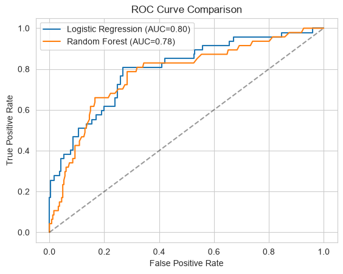
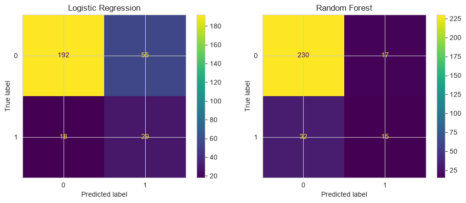
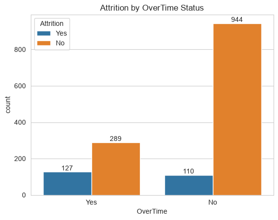
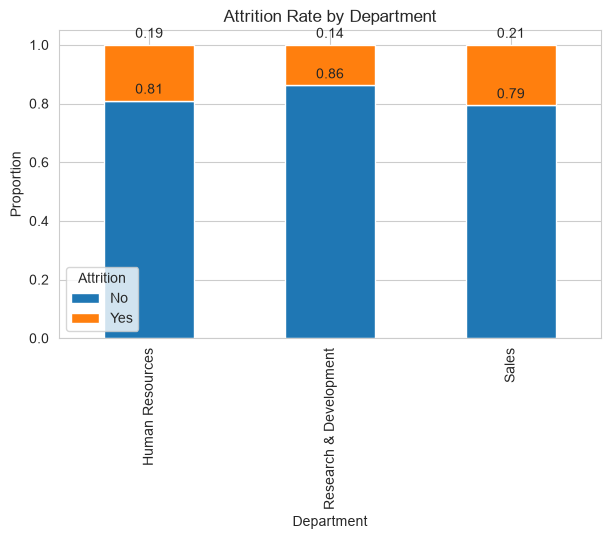
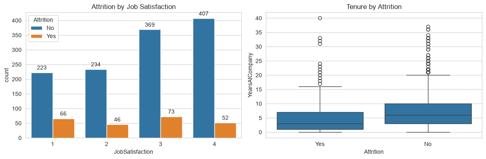
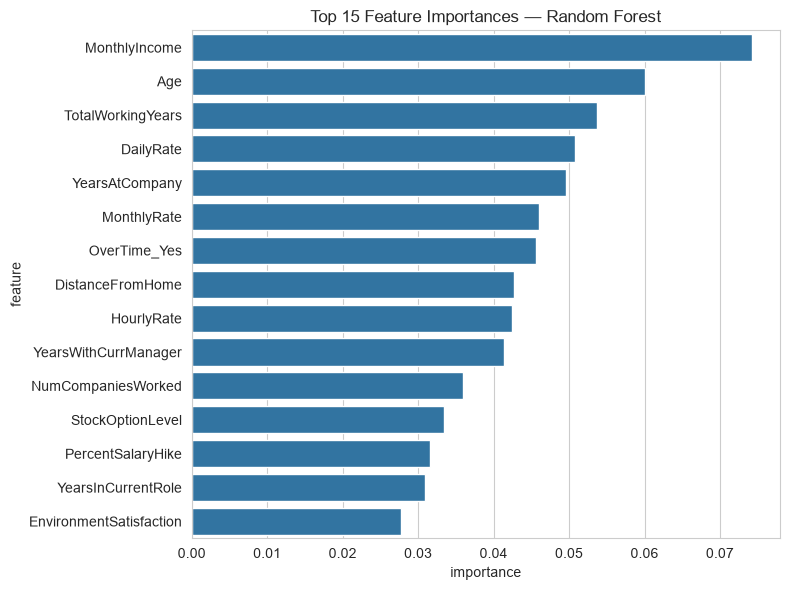

# Employee Attrition Prediction & Retention Analysis

## Overview
This project uses employee-level HR data to analyze attrition patterns and develop machine-learning models that identify employees at elevated risk of leaving. The goal is to support proactive retention planning by combining exploratory analysis, predictive modeling, and business recommendations.

## Business Problem
Employee turnover is costly and disruptive to workforce planning, team continuity, and organizational performance. This project identifies employee attributes associated with attrition and evaluates how effectively predictive models can flag employees at elevated risk of leaving.

## Dataset
**IBM HR Analytics Employee Attrition & Performance** dataset from Kaggle.

- Approximately 1,470 employee records
- 35 employee and job-related features
- Includes department, overtime status, job satisfaction, tenure, compensation, job role, commuting distance, and attrition status
- Target variable: `Attrition`, where `Yes` indicates an employee left and `No` indicates an employee stayed

## Approach
- Conducted exploratory data analysis of attrition patterns by department, overtime status, job satisfaction, and tenure
- Removed constant and identifier columns: `EmployeeCount`, `EmployeeNumber`, `Over18`, and `StandardHours`
- One-hot encoded categorical variables and converted the target variable to binary form: `Yes = 1`, `No = 0`
- Created an 80/20 stratified train-test split to preserve the attrition-class distribution
- Standardized features for logistic regression
- Compared two classification models:
  - Logistic regression baseline using `class_weight="balanced"`
  - Random forest classifier with 300 trees and `class_weight="balanced"`
- Evaluated models using precision, recall, F1-score, confusion matrices, ROC curves, and ROC-AUC instead of relying on raw accuracy

## Why These Metrics Matter
The dataset is imbalanced: approximately 84% of employees stayed and 16% left. A model that predicts every employee will stay could achieve approximately 84% accuracy while identifying zero employees who actually leave.

For this retention use case, recall measures how many employees who left were correctly identified, precision measures how often flagged employees actually left, and ROC-AUC measures how effectively a model distinguishes employees who leave from employees who stay across different probability thresholds.

## Model Results

| Model | Attrition Recall | Correctly Identified Leavers | ROC-AUC | Key Tradeoff |
|---|---:|---:|---:|---|
| Logistic Regression | 61.7% | 29 of 47 | 0.80 | Catches more at-risk employees but produces more false positives |
| Random Forest | 31.9% | 15 of 47 | 0.78 | Produces fewer false positives but misses more employees who leave |

Logistic regression outperformed random forest for identifying employee attrition risk, achieving a ROC-AUC of 0.80 compared with 0.78. It correctly identified 29 of 47 employees who left, producing approximately 62% recall, while random forest identified 15 of 47 leavers, or approximately 32% recall.

Although logistic regression generated more false positives, it was selected as the preferred model because the retention use case prioritizes identifying more at-risk employees and creating more opportunities for early intervention.

<!-- CHART PLACEHOLDER: Save the ROC chart as images/roc_curve_comparison.png -->


<!-- CHART PLACEHOLDER: Save the confusion matrix image as images/confusion_matrix_comparison.png -->


## Key Exploratory Findings

- Sales had the highest attrition rate across the three departments, at approximately 21%.
- Research & Development had the highest retention rate, with approximately 86% of employees remaining.
- Employees who worked overtime had an attrition rate of approximately 31%, compared with approximately 10% for employees who did not work overtime.
- Although the no-overtime group was larger overall, the overtime group had slightly more employees leave, indicating a disproportionately higher attrition risk among employees who worked overtime.
- Employees with the lowest job-satisfaction rating had the highest attrition rate, at approximately 23%, suggesting that lower job satisfaction is associated with a greater risk of departure.

<!-- CHART PLACEHOLDER: Save the overtime plot as images/overtime_attrition.png -->


<!-- OPTIONAL CHART PLACEHOLDER: Save the department chart as images/department_attrition.png -->


<!-- OPTIONAL CHART PLACEHOLDER: Save the satisfaction and tenure chart as images/satisfaction_tenure_attrition.png -->


## Feature Importance
The random forest model identified monthly income, age, total working years, daily rate, years at the company, overtime status, distance from home, and years with the current manager as influential features for predicting attrition.

Feature importance represents a variable’s usefulness to the random forest’s predictions. It does not prove causation and does not independently indicate whether higher or lower values increase attrition risk.

<!-- CHART PLACEHOLDER: Save the feature importance chart as images/random_forest_feature_importance.png -->


## Recommendation
HR should review overtime practices and conduct targeted retention check-ins with employees who regularly work overtime, especially employees reporting lower job satisfaction or those early in their tenure. Employees who worked overtime had an attrition rate of approximately 31%, compared with approximately 10% among employees who did not work overtime, making workload and work-life balance important areas for further investigation.

The predictive model should help HR prioritize retention conversations and deeper review—not replace manager judgment, employee feedback, or fair employment practices. Before operational use, the organization should validate these findings using its own workforce data and retention outcomes.

## Limitations
- The dataset represents a single organization and one historical period; findings may not generalize to other industries, companies, or labor markets.
- This analysis identifies predictive associations rather than causal relationships.
- Feature importance indicates predictive usefulness but does not independently show the direction of a relationship.
- The model should be used as a decision-support signal, not as a standalone termination, promotion, or intervention trigger.
- Additional validation, fairness assessment, threshold selection, and monitoring would be required before operational deployment.

## Tech Stack
Python, Pandas, NumPy, scikit-learn, Matplotlib, Seaborn, Jupyter Notebook

## Project Structure
```text
employee-attrition-prediction/
│
├── attrition_prediction.ipynb
├── hr_employee_attrition.csv
├── README.md
├── requirements.txt
├── .gitignore
├── LICENSE
└── images/
    ├── overtime_attrition.png
    ├── department_attrition.png
    ├── satisfaction_tenure_attrition.png
    ├── confusion_matrix_comparison.png
    ├── roc_curve_comparison.png
    └── random_forest_feature_importance.png
```

## How to Run
1. Clone the repository.
2. Install dependencies:

   ```bash
   pip install -r requirements.txt
   ```

3. Open Jupyter Notebook:

   ```bash
   jupyter notebook
   ```

4. Open `attrition_prediction.ipynb`.
5. Run all notebook cells from top to bottom.

## Data Source
Dataset source: IBM HR Analytics Employee Attrition & Performance dataset, accessed through Kaggle. This project is for educational and portfolio purposes.
